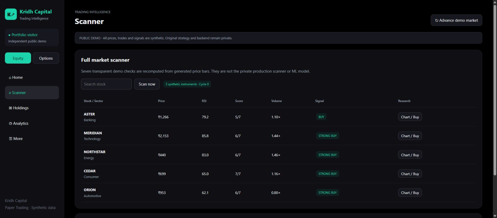

# Kridh Capital — Interactive Public Demo

[**Open the live demo →**](https://himanshuc2406.github.io/kridh-capital-demo/)

A standalone portfolio walkthrough by **Himanshu Chauhan**. It demonstrates a research → portfolio review → simulated paper buy → journal workflow, using independently written browser UI code and fictional fixture data.

**The original Kridh Capital backend and strategy remain private.** This repository does not copy or connect to either private trading repository.

## Walkthrough




## What works

- Overview with computed account value, cash, unrealised P/L and equity allocation.
- Research scanner with instrument search, sector/status filtering and fixed illustrative scores.
- Holdings with weighted average cost, portfolio weight and concentration metrics.
- Locally simulated paper buys with quantity and cash validation.
- Session-only journal and holdings/journal CSV exports.
- Three synthetic chart periods, modal walkthrough and responsive screens.

## Data and confidentiality

All instruments, prices, trades, scores, chart points and performance values are synthetic. They are not live prices, real Kridh returns or predictions. No broker, account credentials, actual journals, private signal formulas or original backend are present. Fees and slippage are not modelled. Refreshing resets the simulation.

The public interface is an independently designed demonstration, not an exact replica of the private product. The demo source is public; the original source remains private.

## Run locally

```sh
python -m http.server 5110 --directory docs
```

Open `http://127.0.0.1:5110`. No packages, build process or API credentials are required. GitHub Pages serves `docs/` on the `main` branch. The optional Google Fonts stylesheet has system-font fallbacks.

## Architecture

`Fictional fixture data → browser state → computed metrics and SVG charts → synthetic CSV exports`

Only HTML, CSS and vanilla JavaScript are used. There is no private-code dependency or trading endpoint.

## Validation

The published demo was inspected in Chrome. Instrument search narrowed the scanner correctly. A paper buy exceeding available cash was rejected; buying 10 ASTR units updated quantity from 120 to 130 and preserved the account value. The journal recorded the action and reset restored the initial cash and positions. JavaScript syntax passed `node --check`; no browser console errors were observed during these checks. Screenshots above are from the published interface. These checks do not validate a trading strategy.

## Author

[Portfolio](https://himanshuc2406.github.io/himanshuc2406/) · [LinkedIn](https://www.linkedin.com/in/himansh-chauhan266/) · [Email](mailto:himanshuc2406@gmail.com)
