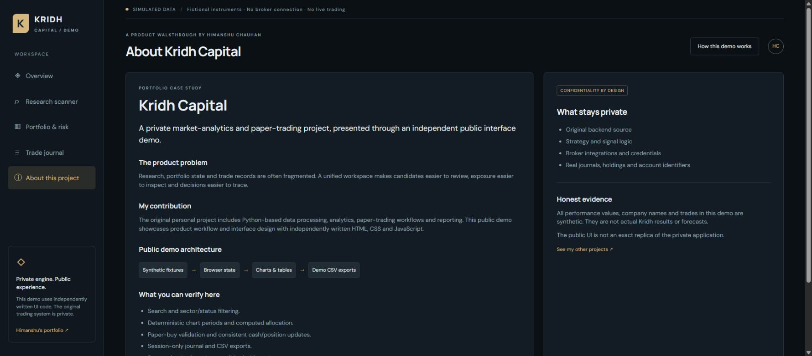

# Kridh Capital — Trading Intelligence Demo

[Open interactive demo](https://himanshuc2406.github.io/kridh-capital-demo/)

An independently written public product preview, guided by the original Kridh Capital README and interface. Kridh brings trading, automatic journaling and evidence from the trader’s own frozen data into one workspace. The original application and repositories remain private and unchanged.

## Explore the workflow
1. Home: black/green portfolio hero, market strip, qualified signals, paper wallets and holdings.
2. Scanner: recomputed seven-check demo signals, synthetic chart, transparent score explanation and similar closed trades (withheld below ten samples).
3. Buy: choose quantity, SL, target and journal note; review rupee risk. A local paper entry freezes score, RSI, regime, source and setup.
4. Advance market: generated prices change, evidence captures taken/not-taken instruments, MAE/MFE update. Optional auto simulation opens an eligible synthetic equity entry.
5. Holdings: partial/full sell at a synthetic quote; cash, realised P&L, illustrative fees and exit context update.
6. Journal: editable notes/mood, source filters, CSV export, cumulative net curve, frozen entry and exit review.
7. Analytics: computed win rate, profit factor, expectancy, setup and discipline splits from this browser’s journal.
8. Options: separate ₹10 lakh wallet, synthetic bid/ask, 25-unit lot validation and separate report/journal.

## Faithful presentation versus simulation
| Area | Public preview |
|---|---|
| Product identity | Trading intelligence, trading + journal + own-data evidence |
| Navigation / design | Black/green, 232px sidebar, mobile bottom navigation, Equity/Options switch |
| Entry-to-exit workflow | Local paper buys, partial/full exits, frozen entry context, notes and mood |
| Scanner / similarity | Independently designed demo checks and simple journal score buckets; not production strategy |
| Price data | Generated synthetic series; no market feed |
| ML / news / broker | Not connected or published |
| Options | Simplified synthetic single-contract research and fills, not full production chain |
| Rule Validator | Planned original feature; not represented as validated or shipped |
| Private IP | No original backend, model, prompts, schemas, secrets or real trading records |

Demo figures do not represent actual performance. Charges and execution are simplified. This public preview covers the core workflow, not every production feature. State is stored only under `kridh_public_demo_v2` in browser localStorage. Reset clears only the demo state.

## Run
Serve `docs/` with any static web server. No dependencies or API keys. GitHub Pages publishes `main:/docs`.

Built by Himanshu Chauhan. [Portfolio](https://himanshuc2406.github.io/himanshuc2406/)
